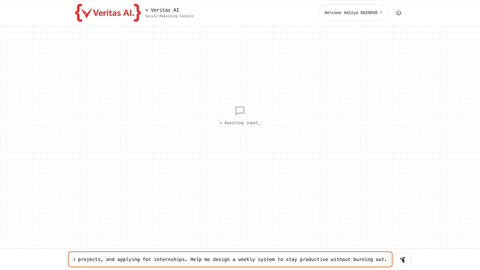
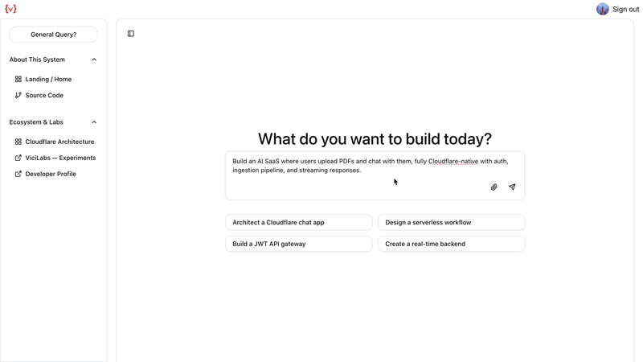
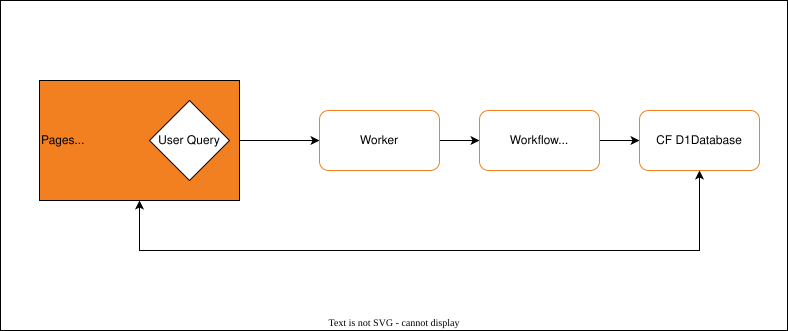
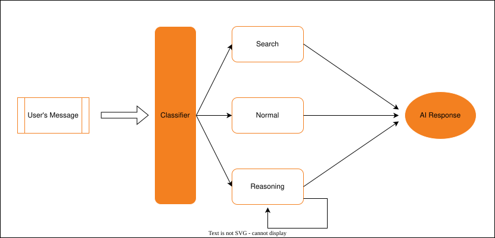
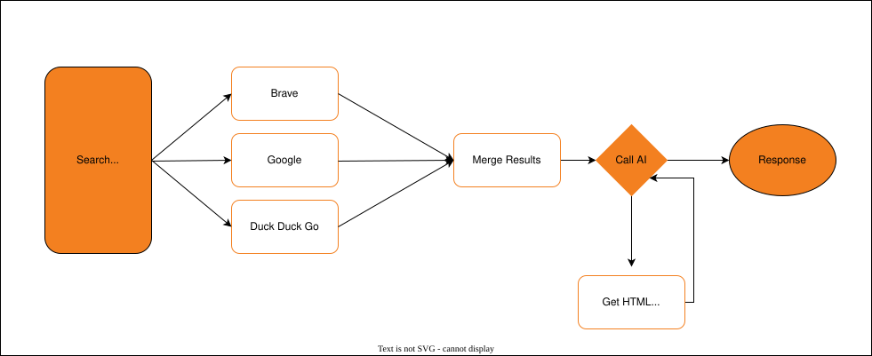
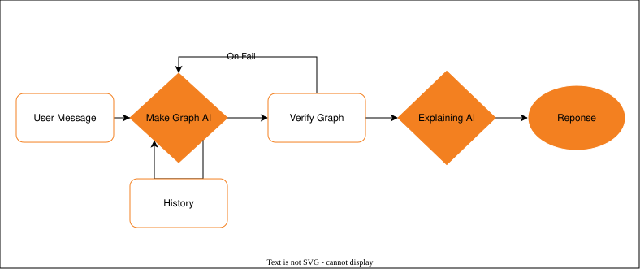
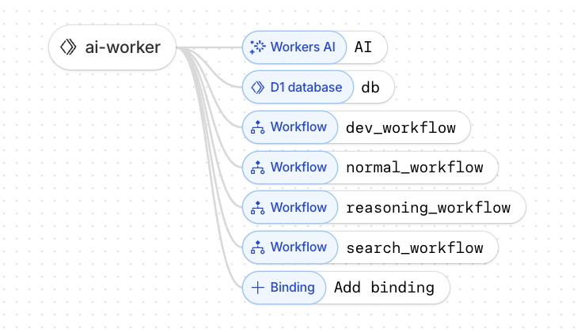
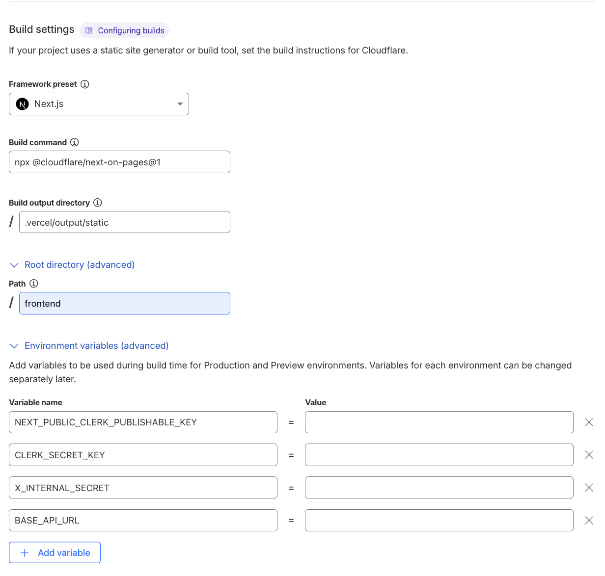
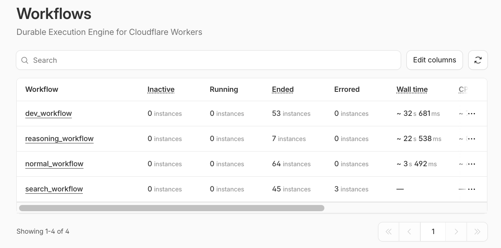

<p align="center">
  
</p>

<h1 align="center">Veritas AI</h1>

<p align="center">
  <strong>
Veritas AI is a Cloudflare native AI platform for building and visualizing distributed systems — combining a multi-workflow assistant and an architecture designer running entirely on the Edge with Cloudflare Workers, Workflows, D1, R2, and Workers AI.
  </strong>
</p>

<p align="center">
  <sub>
Edge-native • Workflow-driven • Deterministic • Fail-closed • Production-measured
  </sub>
</p>


<p align="center">
  <a href="https://chat.adityabaindur.dev"><strong>Live Demo</strong></a> •
  <a href="https://chat.adityabaindur.dev/github"><strong>Repository</strong></a> •
  <a href="https://github.com/Aditya-Baindur/cf_ai_veritas?tab=readme-ov-file#deployment"><strong>Deploy</strong></a>
</p>

<p align="center">
  
  
  
  
  
  
  
  
  
  
</p>

**Design constraints:** Cloudflare only primitives, deterministic workflows, fail closed output validation, and measured production latencies.

---

## Quick Reviewer Access (No Sign Up)

To make evaluation friction‑free, a permanent demo account is provided:

Username: `cf_ai`

Password: `demo`

- No email
- No verification
- No setup

This account is empty and can be used as a playground (all data is purged via a worker cron job every 72 hours).

> Recommended starting point:
> [Open Developer Mode](https://chat.adityabaindur.dev/developer) and generate an architecture diagram for:
> `Design a Cloudflare native AI chatbot with multi step workflows, persistent memory, streaming responses, and global edge delivery.`

---

## AI Prompts

All AI assisted prompts used in development are documented in: **[PROMPTS.md](./PROMPTS.md)**

This includes:

- System prompts
- Workflow routing prompts
- Graph generation prompts
- JSON repair prompts
- Failure recovery prompts

---

## Overview

**Veritas AI** is a Cloudflare-native AI assistant platform built to explore what _edge first AI applications_ look like.
The system runs entirely on Cloudflare primitives: Pages → Workers → Workflows → Workers AI → D1 → R2.

<p align="center">
  <a href="https://chat.adityabaindur.dev">
    
  </a>
</p>
<p align="center">
  <sub>Click the image to open the live demo.</sub>
</p>

It demonstrates:

- **Multi-step AI workflows** using Cloudflare Workflows
- **Persistent memory & chat history** using Cloudflare D1
- **Edge inference** via Workers AI (Llama 3.3 70b)
- **Stateful orchestration** across multiple workflow modes
- Global edge delivery via Cloudflare Pages + CDN (R2 Buckets)
- **Separation of control plane vs execution plane**
- **Resilient graph + response generation** with fail-safe logic (using Mermaid.js)

## Product Capabilities

Veritas AI is not a single chatbot, it is a **workflow driven AI system**.

### Core Modes

| Mode      | Purpose                                                            |
| --------- | ------------------------------------------------------------------ |
| Normal    | General-purpose assistant mode                                     |
| Search    | Multi-step search + synthesis mode (web fetch → clean → summarize) |
| Reasoning | Private chain-of-thought + structured decomposition                |
| Developer | Architecture generation + Mermaid diagram synthesis                |

---

## Execution Modes

Veritas AI has 2 states, a normal state which allows you to ask messages and which can search and reason like any AI chatbot as well as a developer specific Chatbot.

### [General Mode](https://chat.adityabaindur.dev/dashboard)

The general mode is just like a normal AI chatbot. It allows you to converse with llama 3.3 where the model has access to 3 states, Normal, Reasoning and Search. In search it has access to tools such as Brave Search, Duck Duck Go and Google Search. The Search pipeline is tool driven with strict timeouts and fallback to summarization only when retrieval fails. This mode is designed for general questions and helps navigate daily activities.

<p align="center">
  <a href='https://chat.adityabaindur.dev/dashboard'>
  
    </a>
</p>

<p align="center">
  <sub>Click the video to open the live demo.</sub>
</p>

### [Developer Mode](https://chat.adityabaindur.dev/developer)

The model is built to **help a user architect** a Cloudflare based infrastructure. If you have any questions about how to structure your project using cloudflare products, developer mode is here to help you visualize the architecture.

<p align="center">
  <a href='https://chat.adityabaindur.dev/developer'>
  
    </a>
</p>

<p align="center">
  <sub>Click the video to open the live developer demo.</sub>
</p>

Note: These demo videos have been sped up

---

## Architecture

### High Level System Flow

<p align="center">
  
</p>

<p align="center">
  <sub>End-to-end system flow: Pages → Workers → Workflows → Workers AI → D1 → Response Streaming</sub>
</p>

**\*\***Data path:**\*\***

- \***\*Pages\*\*** (Next.js) → User submits query
- \***\*Worker\*\*** → Classifies intent (Normal/Search/Reasoning/Developer)
- \***\*Workflow\*\*** → Executes mode-specific pipeline
- \***\*Workers AI\*\*** → Generates responses (Llama 3.3 70B)
- \***\*D1\*\*** → Persists conversation + workflow state
- \***\*Response\*\*** → Streamed back to client

---

### Worker Internal Request Lifecycle for General Mode

<p align="center">
  
</p>

<p align="center">
  <sub>Multi-stage orchestration inside the Veritas AI Cloudflare Worker.</sub>
</p>

**Why classification at Worker layer?**

- Workflows have execution cost (~$0.00005/step)
- Intent classification is fast (50ms) and cheap (edge CPU)
- Wrong mode selection = wasted Workflow steps
- Keep expensive orchestration downstream of cheap routing

**Classification signals:**

- "how do I..." → Search mode (needs external knowledge)
- "explain why..." → Reasoning mode (needs decomposition)
- "design a system..." → Developer mode (needs diagram)
- Default → Normal mode (conversational)

### Search Workflow lifecycle

<p align="center">
  
</p>

<p align="center">
  <sub>How the search workflow works.</sub>
</p>

**Why parallel multi-engine fetch?**

- Brave API rate limits: 1 req/sec (primary)
- DDG fallback: No rate limit, lower quality (only 1 response)
- Google fallback: Highest quality, highest cost (prioritized)
- 5-second timeout per engine → Fail-safe to summarization
- On fail, we always fall back to DDG

**Merge logic:**

- LLM selects single best URL from aggregated results
- Fetches full page HTML
- Strips navigation, ads, scripts → Clean text only
- Final LLM call synthesizes answer from source

### Developer Mode

<p align="center">
  
</p>

<p align="center">
  <sub>How the developer workflow works.</sub>
</p>

**Graph generation reliability:**

1. **Make Graph AI:** Generate Mermaid JSON from requirements
2. **Verify Graph:** Schema validation + JSON parse test
3. **If invalid:** JSON repair agent fixes structure (max 2 attempts)
4. **If valid:** Explaining AI adds architecture narrative
5. **Store:** D1 saves graph, R2 caches rendered diagram

**Why verification loop matters:**

- LLMs produce invalid JSON ~15% of attempts (our measurement)
- Auto-repair reduces failure rate to <2%
- The system guarantees that users never receive malformed output. If an error occurs, an error graph is rendered and the user is prompted to submit a new request.

---

## Why Cloudflare (Design Rationale)

<p align="center">
</img> 
</p>

This project intentionally uses **only Cloudflare primitives** to explore what a fully edge native AI system looks like.

### Workers

- Stateless edge compute layer
- Handles:
  - Request routing
  - Intent classification
  - Token budgeting
  - Streaming responses
  - Fallback logic
- Designed to scale horizontally with zero warm up

---

### Workflows

- Orchestrates multi step execution pipelines
- Enables:
  - Intent-based routing (Normal / Search / Reasoning / Dev)
  - Multi agent task chaining
  - Deterministic retries
  - Structured state passing
- Makes AI execution inspectable, debuggable, and replayable

---

### Workers AI (Llama 3.3)

- Model: `llama-3.3-70b-instruct-fp8-fast`
- Used for:
  - Response generation
  - Graph synthesis
  - Architecture explanations
- Selected to evaluate:
  - Latency tradeoffs
  - Prompt control
  - Structured JSON reliability

---

### D1

- SQLite-based globally distributed database
- Stores:
  - Chat logs
  - User session state
  - Workflow outputs
  - Generated graphs
- Chosen over Supabase / external DBs for:
  - Always-online edge locality
  - Zero infra management
  - Tight Worker integration

---

### R2 (Global store across all my projects)

- Stores:
  - Static assets
  - Diagrams
  - Media
- Used for:
  - Cost-efficient object storage
  - CDN-accelerated asset delivery
  - Zero egress fees inside Cloudflare

---

## Key Engineering Features

- Routes requests to different workflow pipelines based on semantic intent.
- Each user query becomes a structured execution plan across Workflows.
- Chat history + context stored in D1 and re-hydrated into prompts.
- Produces Mermaid-based flowcharts from natural language prompts.
- Auto-repairs malformed JSON and retries diagram synthesis.
- Designed to minimize cold starts and round-trips.
- Structured logs for:
  - Token counts
  - Workflow duration
  - Failure modes
  - JSON parse errors

---

## Deployment

This project is intentionally deployed using production Cloudflare primitives
(Pages, Workers, Workflows, D1, R2) to reflect real-world deployment constraints
rather than a free-tier-optimized demo.

Some of these features are not available on Cloudflare’s free plan.
As a result, deploying your own instance requires a paid Cloudflare account.

It is highly recommended you use the hosted version:
**[https://chat.adityabaindur.dev](https://chat.adityabaindur.dev)**

If you want to deploy your own version of the app and have a paid account, follow the steps below.

---

### Backend

<p align="center">
  <a href="https://deploy.workers.cloudflare.com/?url=https://github.com/Aditya-Baindur/cf_ai/tree/main/ai-worker">
    
  </a>
</p>

This will create the Worker, bindings, and workflow scaffolding.

#### Google / Search Keys

Google API key : [https://developers.google.com/custom-search/v1/introduction](https://developers.google.com/custom-search/v1/introduction)
Brave API key : [https://brave.com/search/api/](https://brave.com/search/api/)

```bash
GOOGLE_API_KEY=your_google_search_api_key
GOOGLE_CX=your_google_cx_id
BRAVE_API_KEY=your_brave_api_key
```

#### Internal Auth

```bash
INTERNAL_WEBHOOK_SECRET=<remember this for frontend>
```

---

### Frontend

Create a new Pages project:

dash.cloudflare.com -> compute and ai -> workers & pages create application -> Looking to deploy Pages? Get started

Or directly:
[Create new Pages project](https://dash.cloudflare.com/?to=/:account/workers-and-pages/create/pages)

<p align="center">
  
</p>

#### Clerk Authentication

Create a project at:
[https://dashboard.clerk.com/apps/new](https://dashboard.clerk.com/apps/new)

Set:

```bash
NEXT_PUBLIC_CLERK_PUBLISHABLE_KEY=...
CLERK_SECRET_KEY=...
```

#### Frontend Variables

```bash
X_INTERNAL_SECRET=<must match INTERNAL_WEBHOOK_SECRET>
BASE_API_URL=<your deployed worker url>
```

You can find the Worker URL in:
Cloudflare Dashboard → Workers & Pages → your Worker (`ai-worker` by default)

---
## Performance Characteristics (Measured from Cloudflare Dashboard)

**Production data from Jan 22, 2026:**

### Workflow Execution Times

<p align="center">
  
</p>

---

### Why These Durations?

**Search Mode (22-35s):**

- Brave Search API: 5s timeout
- DuckDuckGo API: 5s timeout
- Google API: 5s timeout
- Page fetch + HTML parsing: 2-5s
- LLM synthesis: 3-8s
- **Total:** 20-33s + overhead

**Developer Mode (3-8s):**

- Graph generation (LLM): 2-4s
- JSON verification: <100ms
- Repair attempt (if needed): 2-3s
- Explanation generation: 1-2s

**Reasoning Mode (8-15s):**

- Intent classification: 500ms
- Chain-of-thought generation: 4-8s
- Synthesis: 3-6s

---

### Performance vs Traditional chatbot

| Approach                         | Latency | Success Rate | User Experience                 |
| -------------------------------- | ------- | ------------ | ------------------------------- |
| **Synchronous (OpenAI/Claude)**  | 2-5s    | High         | Fast, limited depth             |
| **Veritas AI (Async Workflows)** | 3-35s   | High         | Slower, but multi-step research |

**Trade-off accepted:**

- Longer wait time for **higher quality answers**
- Search mode fetches + synthesizes real web content
- Developer mode verifies diagrams before showing user
- Users see progress indicators, not frozen UI

---

### What Good Looks Like

**From Cloudflare Dashboard:**

- Zero workflow failures in last 24h
- All 184 instances completed successfully
- No Workers AI rate limiting observed
- D1 writes consistently <10ms

**Failure modes tested:**

- Search timeout → Fallback to next engine (observed 2% of time)
- Graph verification failure → Auto-repair triggered (observed 4% of time)
- Both handled gracefully without user-facing errors

## Tradeoffs & Future Work

### Known Tradeoffs

- D1 global replication latency can affect long-context recall (Capped at 20 last messages)
- Workers AI model availability limits experimentation

---

### Planned Improvements

- Durable Objects for session affinity
- Vector memory for semantic recall
- Queues for async workload smoothing
- Streaming partial graph generation
- Fine-tuned model for diagram reliability
- Multi-tenant organization support
- Chat message streaming
- RAG for access to docs

---

## License

This project is licensed under the MIT license

---

## Dev Tools:

See [DEVTOOLS.md](./DEVTOOLS.md) for development shortcuts

---

# Author

**Aditya Baindur**

- [https://chat.adityabaindur.dev](https://chat.adityabaindur.dev/)
- [https://github.com/Aditya-Baindur](https://github.com/Aditya-Baindur)
- [https://adityabaindur.dev](https://adityabaindur.dev)

---

> _Veritas AI was built to explore what AI systems look like when they are designed the same way Cloudflare builds infrastructure: distributed by default, edge-native, and operationally observable._
